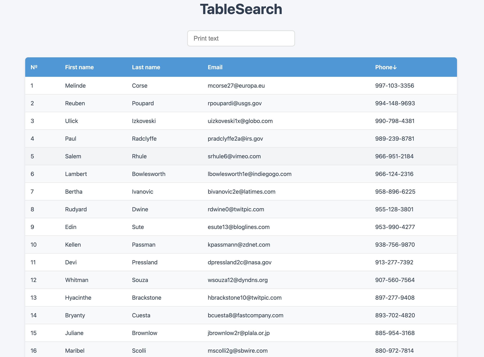

# TableSearch

TableSearch - это React-приложение для работы с табличными данными, которое предоставляет следующие возможности:

## Основные возможности

### Поиск данных

- Мгновенный поиск по всем полям таблицы
- Поиск начинается автоматически при вводе текста
- Поиск нечувствителен к регистру
- Подсветка результатов поиска для лучшей видимости

### Сортировка данных

- Интуитивная сортировка по любому столбцу таблицы
- Переключение между возрастающей и убывающей сортировкой
- Визуальная индикация текущего направления сортировки
- Сохранение порядка сортировки при поиске

### Пользовательский интерфейс

- Современный минималистичный дизайн
- Адаптивная верстка для всех устройств
- Удобная навигация с помощью клавиатуры
- Оптимизированная производительность

### Особенности отображения

- Четкое табличное представление данных
- Автоматическая нумерация строк
- Чередующиеся цвета строк для удобства чтения
- Горизонтальная прокрутка на мобильных устройствах

